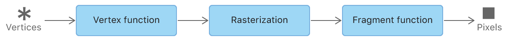
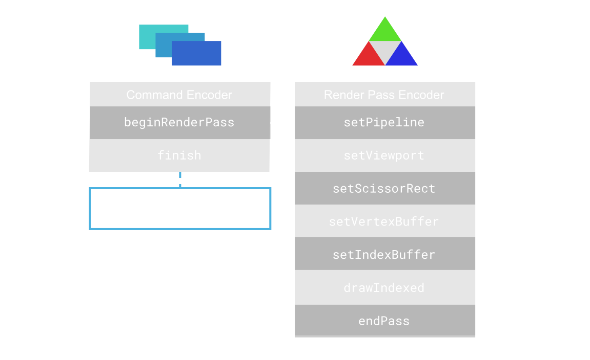

### WebGPU 绘制三角形
> [LearningWebGPU 教程](https://github.com/hjlld/LearningWebGPU)
> [Raw WebGPU](https://alain.xyz/blog/raw-webgpu)

#### 1 WebGPU 介绍
- 参考了 **Vulkan**, **Metal** 和 **DirectX 12** 的 现代计算机图形学API 的设计理念
- 着色器语言使用[WGSL](https://www.w3.org/TR/WGSL/)


#### 2 基本概念
- **GPUAdapter(适配器)**,一个适配器描述了给定GPU的物理性质，如它的名称，扩展和设备的限制
  ```js
  const adapter = await navigator.gpu.requestAdapter();
  ```

- **GPUDevice(设备)**,GPU中用于处理图形的内容
  ```js
  const device = await adapter.requestDevice();
  ```

- **GPUQueue(队列)**,一个队列可以让你异步发送工作交给GPU
  ```js
  device.queue.submit([commandEncoder.finish()]);
  ```

- **GPUCanvasContext(上下文)**
  ```js
  const context = canvasRef.getContext('webgpu');
  ```

- **GPURenderPipeline(渲染管线)**

[图片出处](https://developer.apple.com/documentation/metal/using_a_render_pipeline_to_render_primitives?language=objc)

- **GPUCommandEncoder(指令编码器)**,把需要让 GPU 执行的指令写入到 GPU 的指令缓冲区（Command Buffer）中,当所有的指令写入后，可以调用 commandEncoder.finish() 命令，结束这一编码器。
  ```js
  const commandEncoder = device.createCommandEncoder();
  ```
  
  [图片出处](https://alain.xyz/blog/raw-webgpu#shader-modules)

- **GPURenderPassEncoder(渲染通道编码器)**
  ```js
  const passEncoder = commandEncoder.beginRenderPass(renderPassDescriptor);
  ```

#### 3 顶点着色器
```js
[[stage(vertex)]]
fn main([[builtin(vertex_index)]] VertexIndex : u32)
     -> [[builtin(position)]] vec4<f32> {
  var pos = array<vec2<f32>, 3>(
      vec2<f32>(0.0, 0.5),
      vec2<f32>(-0.5, -0.5),
      vec2<f32>(0.5, -0.5));

  return vec4<f32>(pos[VertexIndex], 0.0, 1.0);
}
```

`[[stage(vertex)]]`
- stage, 属性,声明函数用途; vertex,声明函数用于`顶点着色器`

`[[builtin(vertex_index)]] VertexIndex : u32`
- builtin	属性, 声明一个内置变量,只能应用于入口函数形参和返回值
- vertex_index, 内建变量, 当执行渲染命令时，GPU 会多次调用顶点函数，为每个顶点生成一个索引。名称为: VertexIndex, 类型为: u32


#### 4 片元着色器
```js
[[stage(fragment)]]
fn main() -> [[location(0)]] vec4<f32> {
  return vec4<f32>(1.0, 0.0, 0.0, 1.0);
}
```


#### 5 代码
```js
<!DOCTYPE html>
<head>
  <link rel="stylesheet" href="./style.css">
</head>
<body>
  <div class="content">
    <canvas id="c"></canvas>
  </div>
   <script type="module">
    async function main() {
      // 这里就是着色器的字符串
      const triangleVertWGSL = "..."
      const redFragWGSL = "..."

      const adapter = await navigator.gpu.requestAdapter();
      const device = await adapter.requestDevice();

      const canvasRef = document.querySelector('canvas');
      const context = canvasRef.getContext('webgpu');

      const devicePixelRatio = window.devicePixelRatio || 1;
      const presentationSize = [
        canvasRef.clientWidth * devicePixelRatio,
        canvasRef.clientHeight * devicePixelRatio,
      ];
      const presentationFormat = context.getPreferredFormat(adapter);

      context.configure({
        device,
        format: presentationFormat,
        size: presentationSize,
      });

      const pipeline = device.createRenderPipeline({
        vertex: {
          module: device.createShaderModule({
            code: triangleVertWGSL,
          }),
          entryPoint: 'main',
        },
        fragment: {
          module: device.createShaderModule({
            code: redFragWGSL,
          }),
          entryPoint: 'main',
          targets: [
            {
              format: presentationFormat,
            },
          ],
        },
        primitive: {
          topology: 'triangle-list',
        },
      });

      function frame() {
        if (!canvasRef) return;

        const commandEncoder = device.createCommandEncoder();
        const textureView = context.getCurrentTexture().createView();

        const renderPassDescriptor = {
          colorAttachments: [
            {
              view: textureView,
              loadValue: { r: 0.0, g: 0.0, b: 0.0, a: 1.0 },
              storeOp: 'store',
            },
          ],
        };

        const passEncoder = commandEncoder.beginRenderPass(renderPassDescriptor);
        passEncoder.setPipeline(pipeline);
        passEncoder.draw(3, 1, 0, 0);
        passEncoder.endPass();

        device.queue.submit([commandEncoder.finish()]);
        requestAnimationFrame(frame);
      }

      requestAnimationFrame(frame);
    }

    window.onload = ()=>{
      main();
    }
   </script>
</body>
</html>
```
